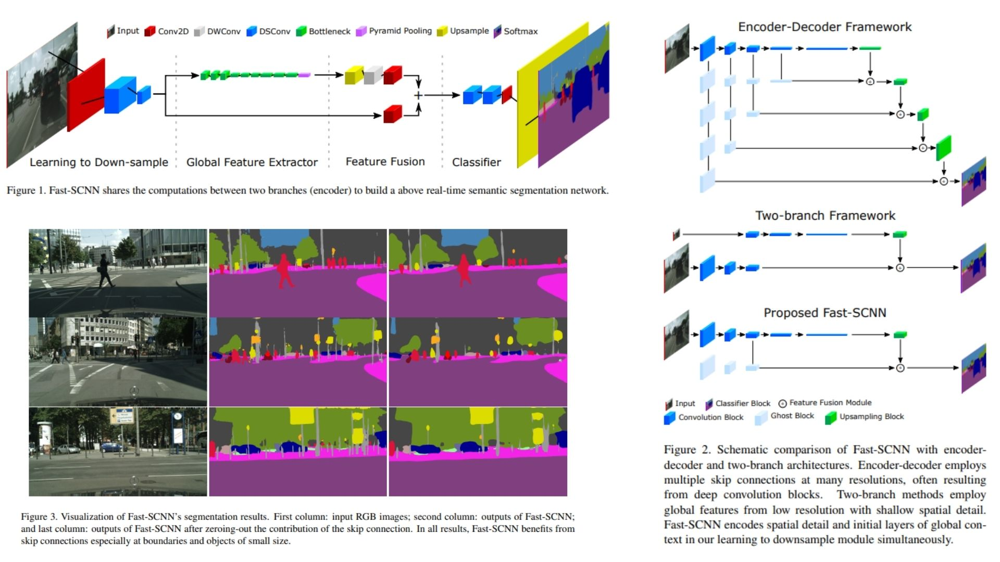

# 📨 Fast-SCNN-Replication — Fast Semantic Segmentation Network

This repository provides a **faithful Python replication** of the **Fast-SCNN framework** for **real-time semantic segmentation**. The implementation follows the original paper pipeline, including a **shared learning-to-downsample module, lightweight global feature extractor with pyramid pooling, and efficient feature fusion module**.

Paper reference: *Fast-SCNN: Fast Semantic Segmentation Network (Poudel et al., 2019)*  https://arxiv.org/abs/1902.04502

---

## Overview 🜃



> The model is designed for **real-time semantic segmentation on high-resolution images**, combining a **shared low-level feature extraction stem** with a **lightweight global context branch**, and merging both streams through an efficient fusion strategy to preserve spatial detail while maintaining computational efficiency.

---

### Key Concepts

- **Input image**

$$
x \in \mathbb{R}^{H \times W \times 3}
$$

- **Learning to downsample module**

The input is progressively reduced to a compact representation using strided convolutions:

$$
H \times W \rightarrow \frac{H}{8} \times \frac{W}{8}
$$

This stage extracts **low-level features such as edges and textures** while sharing early computation between branches.

- **Global feature extractor**

A lightweight bottleneck-based encoder captures semantic context:

$$
F_{global} = f_{\text{bottleneck}}(F_{1/8})
$$

followed by **pyramid pooling** to aggregate multi-scale context:

$$
F_{ppm} = \text{PPM}(F_{global})
$$

- **Feature fusion module**

High-resolution and low-resolution features are combined efficiently:

$$
F_{fusion} = \sigma(\text{Conv}(F_{high}) + \text{Conv}(\text{DWConv}(F_{low})))
$$

This merges:
- spatial detail from high-resolution path
- semantic context from low-resolution path

- **Final prediction**

$$
y = \text{Upsample}(F_{fusion}) \in \mathbb{R}^{H \times W \times C}
$$

producing **pixel-wise class logits over C classes**.

---

## Why Fast-SCNN Matters 🜄

- real-time semantic segmentation on high-resolution inputs  
- shared early feature computation for efficiency  
- lightweight global context modeling via bottleneck + PPM  
- minimal fusion overhead for embedded deployment  
- strong speed–accuracy trade-off design

---

## Repository Structure 🏗️

```
FastSCNN-Replication/
├── src/
│   ├── blocks/
│   │   ├── conv.py               
│   │   ├── bottleneck.py        
│   │   ├── ppm.py                
│   │   └── fusion.py            
│   │
│   ├── modules/
│   │   ├── learning_to_downsample.py   
│   │   ├── global_extractor.py        
│   │   ├── classifier.py           
│   │
│   ├── model/
│   │   └── fast_scnn.py              
│   │
│   ├── head/
│   │   └── segmentation_head.py    
│   │
│   └── config.py
│
├── images/
│   └── figmix.jpg             
│
├── requirements.txt
└── README.md
```

---

## 🔗 Feedback

For questions or feedback, contact:  
[barkin.adiguzel@gmail.com](mailto:barkin.adiguzel@gmail.com)
